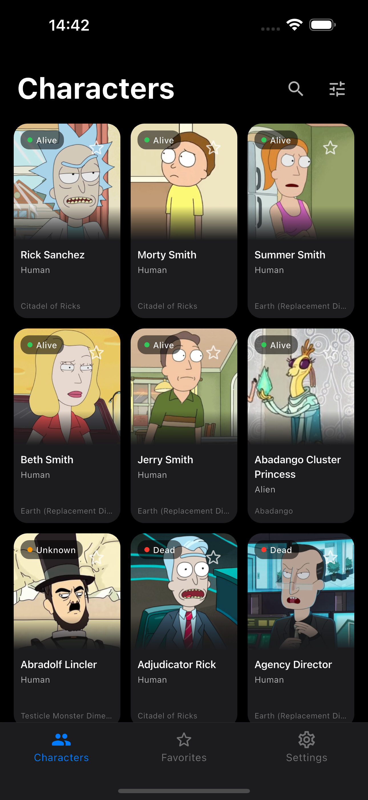
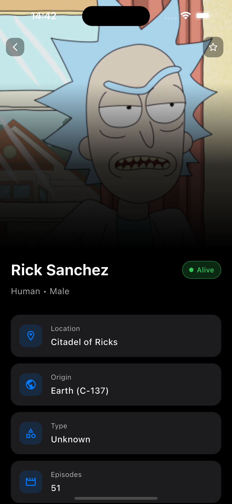
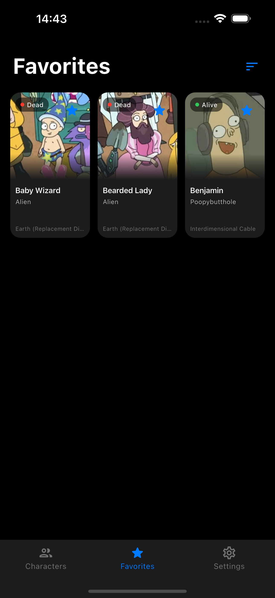
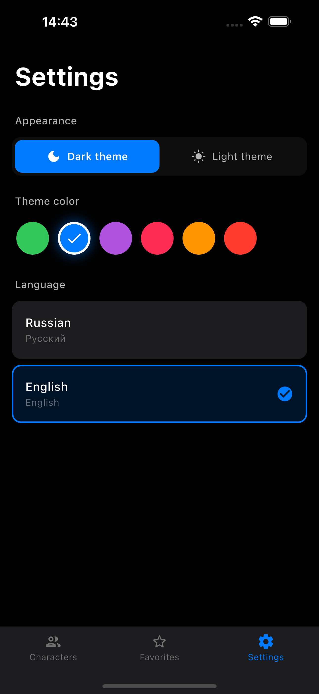

# Rick and Morty Characters

Мобильное приложение для просмотра персонажей мультсериала "Рик и Морти" с возможностью добавления в избранное и оффлайн-доступом.


## 📱 Скриншоты

<p align="center">
  
  
  
  
</p>

## ✨ Функционал

### Основные возможности (по ТЗ)
- 📋 Список персонажей с пагинацией (бесконечный скролл)
- ⭐ Добавление/удаление из избранного
- 📊 Сортировка избранного (по имени, по статусу)
- 📖 Детальная карточка персонажа
- 🧭 BottomNavigationBar навигация
- 📴 Оффлайн-режим (кэширование данных и изображений)
- 💾 Сохранение избранного в локальную БД (Hive)

### Дополнительные возможности (сверх ТЗ)
- 🔍 **Поиск** по имени персонажа
- 🎛 **Фильтрация** по статусу, виду и полу
- 🌙 **Тёмная и светлая тема** с переключателем
- 🎨 **6 цветов акцента** на выбор
- 🌍 **Локализация** (русский/английский)
- 💀 **Shimmer-скелетоны** при загрузке
- ⬇️ **Pull-to-refresh** для обновления списка
- 🔄 **Экран ошибки** с кнопкой повторной попытки
- ✨ **Анимации** появления карточек и добавления в избранное
- 🎬 **Hero-анимация** при переходе к деталям

## 🛠 Технологии

| Технология | Назначение |
|------------|------------|
| **Provider** | State management |
| **Dio** | HTTP-клиент для API запросов |
| **Hive** | Локальная NoSQL база данных |
| **Cached Network Image** | Кэширование изображений |
| **Shimmer** | Анимация загрузки |

## 📁 Структура проекта
```
lib/
├── main.dart                     # Точка входа
├── models/
│   └── character.dart            # Модель персонажа
├── providers/
│   ├── characters_provider.dart  # Логика персонажей, фильтры, поиск
│   └── settings_provider.dart    # Настройки (тема, язык, цвет)
├── screens/
│   ├── home_screen.dart          # Главный экран
│   ├── favorites_screen.dart     # Избранное
│   ├── settings_screen.dart      # Настройки
│   └── character_detail_screen.dart  # Детали персонажа
├── services/
│   ├── api_service.dart          # Работа с API
│   ├── database_service.dart     # Работа с БД
│   └── translation_service.dart  # Локализация
└── widgets/
    ├── character_card.dart       # Карточка персонажа
    ├── filter_sheet.dart         # Модальное окно фильтров
    ├── skeleton_card.dart        # Скелетон загрузки
    └── error_widget.dart         # Виджет ошибки
```

## 🚀 Запуск проекта

### Требования
- Flutter 3.38.6+
- Dart 3.10.7+
- Xcode 16+ (для iOS)

### Установка

1. Клонируйте репозиторий:
```bash
git clone https://github.com/yourusername/rick_and_morty_app.git
cd rick_and_morty_app
```

2. Установите зависимости:
```bash
flutter pub get
```

3. Сгенерируйте файлы Hive:
```bash
dart run build_runner build
```

4. Запустите приложение:
```bash
flutter run
```

## 🧪 Тестирование
```bash
flutter test
```

**Покрытие тестами:**
- ✅ CharactersProvider (фильтры, сортировка, состояние)
- ✅ Character Model (парсинг JSON)

## 📦 Зависимости
```yaml
dependencies:
  dio: ^5.4.0
  hive: ^2.2.3
  hive_flutter: ^1.1.0
  cached_network_image: ^3.3.1
  provider: ^6.1.1
  shimmer: ^3.0.0

dev_dependencies:
  hive_generator: ^2.0.1
  build_runner: ^2.4.8
```

## 🌐 API

Приложение использует [Rick and Morty API](https://rickandmortyapi.com/documentation/)

**Эндпоинты:**
- `GET /character?page={page}` — список персонажей с пагинацией

## 👤 Автор

**Никита Финников**
- GitHub: [@SESHP](https://github.com/SESHP)

## 📄 Лицензия

MIT License